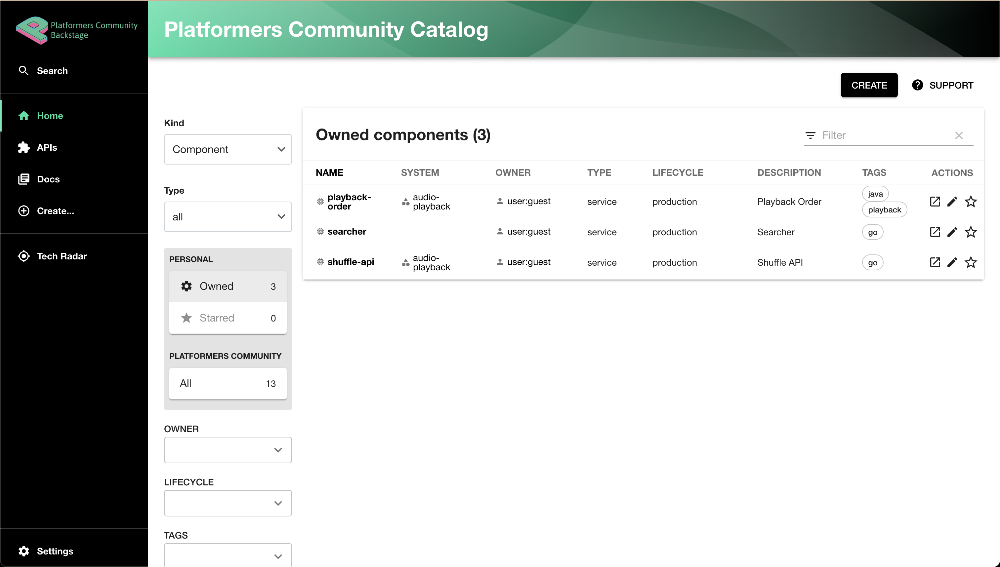

# backstage-helm-chart


This is a Helm chart repo to deploy backsage.
Deploy Backstage in 5 minutes.

<br>
<a href="https://www.platformers.community/">
Powered by 
The Platformers Community
 </a>

## Screenshot



## How to deploy

1. Deploy PG using CNPG
2. Deploy Backstage

### Deploy CNPG

- Deploy cnpg

```bash
helm repo add cnpg https://cloudnative-pg.github.io/charts
helm repo update
helm upgrade --install cnpg cnpg/cloudnative-pg --namespace cnpg-system --create-namespace 
```

- Create the first DB

```bash
kubectl apply -f - << EOF
---
apiVersion: v1
kind: Namespace
metadata:
  name: backstage
---
apiVersion: v1
kind: Secret
type: kubernetes.io/basic-auth
metadata:
  name: app-secret
  namespace: backstage
data:
  username: YXBw
  password: cGFzc3dvcmQ=
---
apiVersion: postgresql.cnpg.io/v1
kind: Cluster
metadata:
  name: backstage
  namespace: backstage
spec:
  instances: 1
  primaryUpdateStrategy: unsupervised
  storage:
    size: 1Gi
  bootstrap:
    initdb:
      secret:
        name: app-secret
      postInitSQL:
        - ALTER ROLE app CREATEDB
EOF
```

## Deploy Backstage

- Clone this repo

- [Generate GH access token here](https://github.com/settings/tokens)

The Required Permissions:

```bash
Reading software components:
- repo

Reading organization data:
- read:org
- read:user
- user:email

Publishing software templates:
- repo
- workflow (if templates include GitHub workflows)
```

- Install the chart using your personal access token

```bash
helm upgrade --install  backstage ./backstage -n backstage --set github.accessToken=""
```

## Go to Backstage UI

```bash
open http://127.0.0.1:7007
kubectl port-forward svc/backstage -n backstage 7007:7007
```
